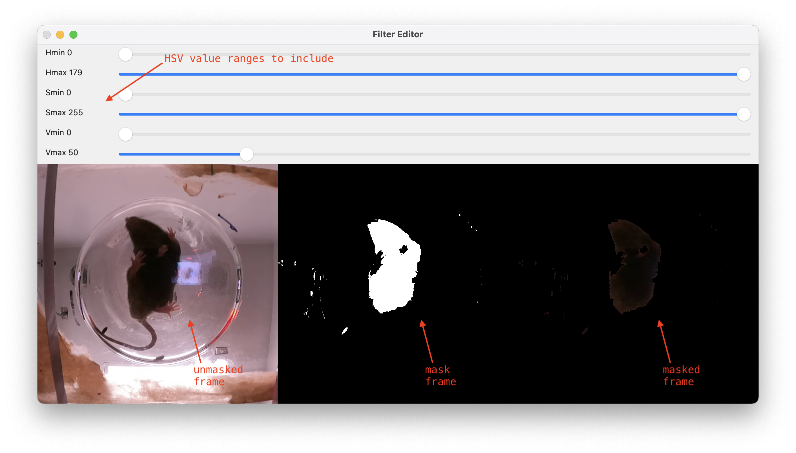

# ScoreCR

## Overview

### What
ScoreCR is a tool for rapid manual scoring of bottom-view videos from mouse cylinder rearing experiments. It enables efficient, intuitive annotation of forepaw placement (left, right, both, or neither) and provides automated detection of potential rearing intervals using computer vision and peak detection algorithms.

### Why
The cylinder rearing test is a widely used behavioral assay for assessing forelimb asymmetry in rodent models of neurological disorders. Manual scoring of these videos is time-consuming and prone to human error. ScoreCR addresses these challenges by:

- **Standardizing the scoring process** with automated event detection
- **Reducing analysis time** through smart navigation and batch labeling
- **Improving accuracy** with visual feedback and consistent criteria
- **Enabling reproducible research** with structured data output

### Features
- **Automated Rearing Detection**: Uses computer vision to identify potential rearing events through HSV color thresholding and peak detection
- **Interactive ROI Selection**: Ctrl+drag to define circular regions of interest for analysis
- **Efficient Batch Labeling**: Set step sizes (1-9) to label multiple frames at once
- **Real-time Visual Feedback**: Color-coded timeline showing scored and unscored regions
- **Smart Navigation**: Jump directly to potential rearing events for efficient scoring
- **Customizable Filters**: Adjust HSV thresholds with real-time preview
- **Video Processing**: Built-in video re-encoding capabilities
- **Multiple Output Formats**: CSV files for scoring data and event properties
- **Screenshot Capture**: Save frames for documentation and analysis

## Install

### Option 1: Download Pre-built Executable (Recommended)
Download the latest release from the [GitHub Releases](https://github.com/cyxmon/scorecr/releases) page:
- **macOS**: Download `scorecr-macos.zip`, extract and run `scorecr.app`
- **Windows**: Download `scorecr-windows.zip`, extract and run `scorecr.exe`

### Option 2: Using Pixi (For Development)
1. Install [Pixi](https://pixi.sh/) if you haven't already
2. Clone or download this repository
3. Navigate to the project directory
4. Run the application:
   ```bash
   pixi run python scorecr.py
   ```

### Option 3: Manual Installation
```bash
pip install opencv-python numpy pandas scipy ffmpeg-python
```

### Dependencies
This project uses [Pixi](https://pixi.sh/) for dependency management. The following dependencies are required:

- Python 3.13+
- OpenCV 4.11+
- NumPy 2.2+
- Pandas 2.2+
- SciPy 1.15+
- FFmpeg-Python 0.2+
- PyInstaller 6.13+ (for building executable)

### How to Run

#### Pre-built Executable:
Simply double-click the downloaded executable file, or run from terminal:
- **macOS**: `./scorecr.app/Contents/MacOS/scorecr`
- **Windows**: `scorecr.exe`

#### With Pixi:
```bash
pixi run python scorecr.py
```

#### With standard Python:
```bash
python scorecr.py
```

#### Building Your Own Executable
To create a standalone executable:
```bash
pixi run pyinstaller --onefile --noconsole scorecr.py
```
The executable will be created in the `dist/` directory.

## Instructions

Below we describe end-to-end usage, steps to preprocess, how to score, and how to read the output.


*Main scoring interface showing video frame, timeline progress bar, and navigation controls*

### User Interface & Shortcuts

#### Interface Elements
- **Top progress bar:**
  - Green triangle: current position
  - Blue/yellow/pink bars: scored frames (right/left/both)
  - Gray blocks: unscored/potential rearing intervals
- **Center, top-left, and top-right** of the screen display the previous, current, and next frame labels, respectively
- **Bottom left corner** shows the current step size

#### Navigation Shortcuts
- **Frame Navigation:**
  - **Right mouse button**: forward by step size
  - **Left mouse button**: backward by step size
  - **Mouse wheel**: step forward/backward by step size
  - **Shift+d**: forward by step size
  - **Shift+a**: backward by step size
  - **Space**: toggle fast-forward/pause mode
  - **Numbers 1-9**: set step size (for navigation and batch labeling)

#### Event Navigation
- **e**: jump to next potential rearing event (gray chunk)
- **q**: jump to previous potential rearing event (gray chunk)

#### Tools & Save
- **x**: screenshot current frame (saves as `[video]_screenshot_[frame].png`)
- **c**: save scoring results
- **z**: exit (auto-save)
- **f**: open HSV filter editor for threshold adjustment
- **Shift+r**: re-encode current video (crop to square, scale to 720x720, limit to 5 minutes at 15fps)

### Preprocessing & Filters

#### Initial Setup
1. On first use, select the bottom circular ROI using **Ctrl + Left mouse button** and drag to define the circular region
2. Preprocessing will start automatically after ROI selection
3. During preprocessing, the tool analyzes the video to detect potential rearing events using HSV color thresholding and peak detection
4. After preprocessing, the screen color returns to normal and gray blocks appear on the timeline indicating potential rearing events

#### HSV Filter Editor

*HSV filter editor for adjusting color thresholds with real-time preview*

- Access the filter editor by pressing **f**
- Adjust HSV parameters with trackbars for real-time preview
- The editor shows original frame, mask, and filtered result side by side
- Press **Enter** to apply changes or **ESC** to cancel

### Scoring

#### Scoring Criteria
Evaluate forepaw placement during rearing events:
- **Left forepaw only**: Mouse primarily uses left forepaw to contact the cylinder wall
- **Right forepaw only**: Mouse primarily uses right forepaw to contact the cylinder wall
- **Both forepaws**: Mouse uses both forepaws simultaneously or alternately
- **Neither/None**: No clear forepaw placement or ambiguous contact

#### Scoring Controls
- **a**: left forepaw
- **s**: both forepaws
- **d**: right forepaw
- **w**: neither/none (undo/mislabeled)
- Relabel by simply overwriting with a, s, or d
- **Batch scoring**: Set step size (1-9) to label multiple consecutive frames at once

### Data Output

#### Score File (`[video]_score.csv`)
- Frame-by-frame scoring results with summary counts in the first row
- Columns: `label`, `l`, `r`, `b`, `n` (left, right, both, none)
- Statistics are based on frame counts, not event counts

#### Properties File (`[video]_properties.csv`)
- Detected rearing event intervals and properties
- Contains start/end frame indices and event characteristics
- Used for navigation between potential rearing events

#### Screenshot Files
- Saved as `[video]_screenshot_[frame].png`
- Captures current frame with all interface overlays for documentation

#### Cylinder Rearing Score Calculation
```
(left forepaw frames - right forepaw frames) / (total rearing frames) * 100
```

## Technical Details

### Processing Pipeline
1. **ROI Selection**: User defines circular region of interest using Ctrl+drag
2. **Preprocessing**: 
   - Extracts circular ROI from each frame
   - Applies Gaussian blur and HSV color space conversion
   - Performs color thresholding to detect mouse body
   - Downsamples to 5 FPS for efficient processing


*Original bottom-view video showing mouse cylinder rearing behavior*


*HSV color thresholding result showing detected mouse body regions*

3. **Event Detection**:
   - Uses SciPy's `find_peaks` to identify potential rearing events
   - Detects peaks with prominence > 30% of max signal
   - Filters events by width (max 5 seconds)
   - Analyzes inverted signal where valleys indicate rearing events


*Signal analysis showing the percentage of detected mouse body pixels over time. Peaks (valleys in the inverted signal) indicate potential rearing events where the mouse body occupies less of the circular ROI*

4. **Manual Scoring**: User labels detected events with keyboard shortcuts

### Algorithm Details
- **HSV Thresholding**: Default range (0,0,0) to (180,255,50) for detecting dark mouse body
- **Peak Detection**: Uses prominence-based detection with relative height filtering
- **Signal Processing**: Inverted percentage signal where lower values indicate rearing
- **Temporal Filtering**: Events longer than 5 seconds are excluded as unlikely rearing events

### File Structure
- `[video]_score.csv`: Frame-by-frame scoring results with summary counts
- `[video]_properties.csv`: Detected rearing event intervals and properties  
- `[video]_screenshot_[frame].png`: Screenshot captures with interface overlays

## Known Issues

### Platform-Specific Issues
- **macOS Mouse Wheel**: Some users may experience inconsistent scroll direction. If scrolling feels inverted, this is a known OpenCV issue on macOS
- **Window Scaling**: On high-DPI displays, the interface may appear too small. The tool automatically scales based on video resolution

### Performance Considerations
- **Large Video Files**: Videos longer than 5 minutes or with high resolution may cause slow preprocessing. Use the built-in re-encoder (R key) to optimize
- **Memory Usage**: Very long videos may consume significant RAM during preprocessing. Consider splitting long recordings

### Workflow Limitations
- **ROI Selection**: Must be redone if preprocessing fails or if different ROI is needed
- **Batch Editing**: Cannot undo batch operations - use single-frame mode for uncertain labels
- **Video Formats**: Some uncommon video codecs may not be supported. Re-encoding usually resolves compatibility issues

### Troubleshooting
- **Preprocessing Stuck**: Ensure ROI selection covers the cylinder area properly
- **No Events Detected**: Adjust HSV thresholds using the filter editor (f key)
- **Performance Issues**: Use video re-encoding feature to optimize file size and format

## Contact

For questions or suggestions, please contact the developer.
