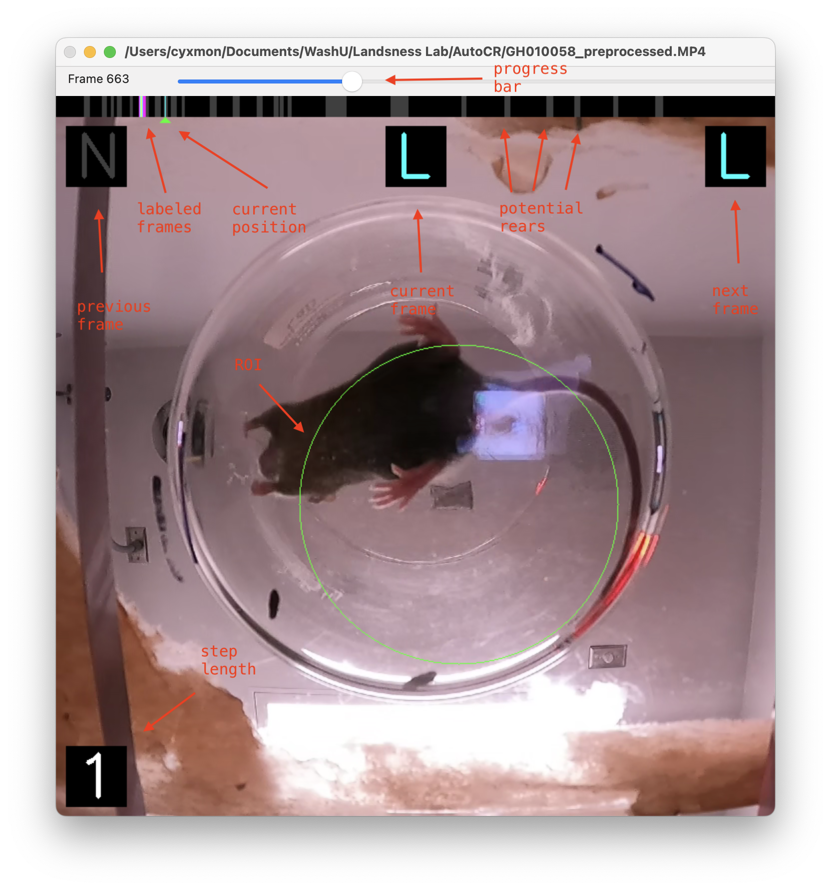

# ScoreCR

## Overview

ScoreCR is a tool for rapid manual scoring of bottom-view videos from mouse cylinder rearing experiments. It enables efficient, intuitive annotation of forepaw placement (left, right, both, or neither) and provides automated detection of potential rearing intervals using computer vision and peak detection algorithms.

## Usage Instructions


*Main scoring interface showing video frame, timeline progress bar, and navigation controls*


*HSV filter editor for adjusting color thresholds with real-time preview*

### 1. Preprocessing & Interface
- On first use, select the bottom circular ROI using **Ctrl + Left mouse button** and drag to define the circular region; preprocessing will start automatically.
- During preprocessing, the tool analyzes the video to detect potential rearing events using HSV color thresholding and peak detection.
- After preprocessing, the screen color returns to normal.
- **Top progress bar:**
  - Green triangle: current position
  - Blue/yellow/pink bars: scored frames (right/left/both)
  - Gray blocks: unscored/potential rearing intervals
- The **center, top-left, and top-right** of the screen display the previous, current, and next frame labels, respectively.
- **Bottom left corner** shows the current step size.

### 2. Shortcuts & Mouse Operations
- **Frame Navigation:**
  - **Right mouse button**: forward by step size
  - **Left mouse button**: backward by step size
  - **Mouse wheel**: step forward/backward by step size
  - **Shift+D**: forward by step size
  - **Shift+A**: backward by step size
  - **Space**: toggle fast-forward/pause mode
  - **Numbers 1-9**: set step size (for navigation and batch labeling)
- **Jump to Potential Rearing Events:**
  - **e**: jump to next potential rearing event (gray chunk)
  - **q**: jump to previous potential rearing event (gray chunk)
- **Scoring (applies to current step size):**
  - **a**: left forepaw
  - **s**: both forepaws
  - **d**: right forepaw
  - **w**: neither/none (undo/mislabeled)
  - Relabel by simply overwriting with a, s, or d
- **Tools & Save:**
  - **x**: screenshot current frame (saves as `[video]_screenshot_[frame].png`)
  - **c**: save scoring results
  - **z**: exit (auto-save)
  - **f**: open HSV filter editor for threshold adjustment
  - **R**: re-encode current video (crop to square, scale to 720x720, limit to 5 minutes at 15fps)

### 3. Data Output
- **Scoring results** are automatically saved as `[video filename]_score.csv`, with the first row containing label counts.
- **Event properties** are saved as `[video filename]_properties.csv` containing detected rearing intervals.
- **Statistics** are based on frame counts, not event counts.

## Dependencies

This project uses [Pixi](https://pixi.sh/) for dependency management. The following dependencies are required:

- Python 3.13+
- OpenCV 4.11+
- NumPy 2.2+
- Pandas 2.2+
- SciPy 1.15+
- FFmpeg-Python 0.2+
- PyInstaller 6.13+ (for building executable)

## Installation & Setup

### Using Pixi (Recommended)
1. Install [Pixi](https://pixi.sh/) if you haven't already
2. Clone or download this repository
3. Navigate to the project directory
4. Run the application:
   ```bash
   pixi run python scorecr.py
   ```

### Manual Installation
```bash
pip install opencv-python numpy pandas scipy ffmpeg-python
```

## How to Run

### With Pixi:
```bash
pixi run python scorecr.py
```

### With standard Python:
```bash
python scorecr.py
```

Or double-click the executable if you have built one using PyInstaller.

## Features

- **Automated Rearing Detection**: Uses computer vision to identify potential rearing events through HSV color thresholding and peak detection
- **Interactive ROI Selection**: Ctrl+drag to define circular regions of interest for analysis
- **Efficient Batch Labeling**: Set step sizes (1-9) to label multiple frames at once
- **Real-time Visual Feedback**: Color-coded timeline showing scored and unscored regions
- **Smart Navigation**: Jump directly to potential rearing events for efficient scoring
- **Customizable Filters**: Adjust HSV thresholds with real-time preview
- **Video Processing**: Built-in video re-encoding capabilities
- **Multiple Output Formats**: CSV files for scoring data and event properties
- **Screenshot Capture**: Save frames for documentation and analysis

## Technical Details

### Processing Pipeline
1. **ROI Selection**: User defines circular region of interest
2. **Preprocessing**: 
   - Extracts circular ROI from each frame
   - Applies Gaussian blur and HSV color space conversion
   - Performs color thresholding to detect mouse body
   - Downsamples to 5 FPS for efficient processing


*Original bottom-view video showing mouse cylinder rearing behavior*


*HSV color thresholding result showing detected mouse body regions*

3. **Event Detection**:
   - Uses SciPy's `find_peaks` to identify potential rearing events
   - Detects peaks with prominence > 30% of max signal
   - Filters events by width (max 5 seconds)


*Signal analysis showing the percentage of detected mouse body pixels over time. Peaks (valleys in the inverted signal) indicate potential rearing events where the mouse body occupies less of the circular ROI*

4. **Manual Scoring**: User labels detected events with keyboard shortcuts

### File Structure
- `[video]_score.csv`: Frame-by-frame scoring results with summary counts
- `[video]_properties.csv`: Detected rearing event intervals and properties
- `[video]_screenshot_[frame].png`: Screenshot captures

## Typical Use Case

This tool is designed for **manual, efficient scoring and statistical analysis** of bottom-view videos from mouse **Cylinder Rearing** behavioral experiments. It enables:

- **Standardized behavioral data collection** with automated event detection
- **Efficient manual annotation** of forepaw placement during rearing
- **Downstream analysis** with structured CSV output
- **Quality control** through visual feedback and screenshot capabilities

## Building Executable

To create a standalone executable:

```bash
pixi run pyinstaller scorecr.spec
```

The executable will be created in the `dist/` directory.

## Contact

For questions or suggestions, please contact the developer.
